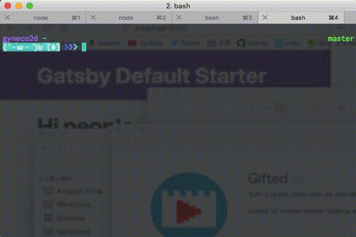

一年前くらいにこの記事（[お前らのターミナルはダサい - Qiita](https://qiita.com/kinchiki/items/57e9391128d07819c321)）読みまして色々弄ったので，現環境をまとめときます．ちなみにドットファイルはGitHubにあげているので`.bash_profile`など全て見たければこちらを．  
[gyneco2d/dotfiles](https://github.com/gyneco2d/dotfiles)

## iTerm2
`iTerm > Preferences... > Keys`のHotkeyの項目で設定できる画面の呼び出しショートカットの設定がとても便利．`Option + Space`で呼び出せるようにしている．確か初期設定．あと，プロファイルを作成できて設定を複数保存できる．  
純正と違う機能，これくらいしか使ってない．

### インストール
[iTerm2 - macOS Terminal Replacement](https://www.iterm2.com)  
サイト下部のDownloadから落としたzipファイルを解凍すると`iTerm.app`がでてくるので`/Applications`に設置すればよい．  


## プログラミング用フォント Ricty
フォントもRictyに変更する．昔，Raspberry Piを触っていてターミナルの初期フォントが酷くて，何の文字だったか全く2つの判別がつかない文字があった．そんなことで数時間詰んだことがある（気づけよ）．ので実際フォントは大事．  
[プログラミング用フォント Ricty](http://www.rs.tus.ac.jp/yyusa/ricty.html)

### インストール
以下の記事の通り．macOS High Sierraでも同様の手順で問題なかったはず．  
[Macでプログラミング用のフォントRictyを設置した話](https://qiita.com/park-jh/items/3c5b9b4aa5619a3631b3)  


## Bashのプロンプト
環境変数の`PS1`を`.bash_profile`で設定して変更する．`PS1`の書式は`$ man bash`してPROMPTINGの項目で確認できる．  
現在は，  
- 2行プロンプトにして  ← 見やすい  
- コマンドの終了コードに対して動的に変化させて  ← かわいい  
- Gitのブランチの右寄せ表示  ← 便利  

するようにしたりしてる．

### 2行プロンプト
カレントディレクトリの表示はしたいけど深くディレクトリ潜ると入力位置が後ろにずれてくのがヤなので，ディレクトリ表示した後に`\n`で改行する．

### 動的にプロンプトを変更する
コマンドの終了時には終了コードと呼ばれるコマンドの成否を表す数値が返る．これを利用してコマンドの成否によってプロンプトを動的に変更できる．この値は`$?`という特殊変数に自動的に格納されるらしい．  
ただし，if文の`[`とかも実はコマンドで，`PS1`に設定している関数内で別のコマンドが実行された時点で`$?`は上書きされてしまうので，プロンプトが表示される前の時点での終了コードを保存したい．  
そのためにBashの[PROMPT_COMMAND](http://tldp.org/HOWTO/Bash-Prompt-HOWTO/x264.html)と呼ばれる環境変数を使う．プロンプトを表示する直前に，この環境変数の内容が実行されるらしい．ここで終了コードをexportするようにした．  
保存した終了コードを元に以下のような感じで文字色を設定するなり，顔文字設定するなりして`PS1`で使う．顔文字に含まれる特殊文字はエスケープするのを忘れないように．  

```bash
export PROMPT_COMMAND="export EXIT_CODE=\$?"

function exit-code-color()
{
    if [ $EXIT_CODE -eq 0 ]
    then
        echo -n '46'
    else
        echo -n '41'
    fi
}

function exit-code-emoticon()
{
    if [ $EXIT_CODE -eq 0 ]
    then
        echo -n "(\`･ω ･´)b [$EXIT_CODE]"
    else
        echo -n "(´･ω ･\`)p [$EXIT_CODE]"
    fi
}
```

### プロンプトの右にブランチ名を表示する
こちらの記事参照して`$PS1_GIT_BRANCH`を作る．右寄せ表示のコツがわかりやすい．  
[bashのプロンプトにブランチ名を右寄せ表示する - ぼくのぬまち 出張版](http://notogawa.hatenablog.com/entry/20120720/1342756620)

### 現在の`PS1`
```bash
export PS1="\n\[\e[35m\]\u \[\e[36m\]\w$PS1_GIT_BRANCH\n\[\e[\$(exit-code-color)m\]\$(exit-code-emoticon)\[\e[0m\] \[\e[34m\]❯\[\e[35m\]❯\[\e[36m\]❯\[\e[0m\] "
```

## まとめ
**(\`･ω ･´)b  kawaii**


Gitのブランチが常に確認できるし，コマンド失敗するとプロンプトがｼｮﾎﾞｰﾝする．プロンプトを動的に変更するのは遊びでやったのだけど，npmでパッケージ入れたときとか，色々出力されてるけど結局成功したの？失敗したの？てときなどにパッとわかるので意外に便利．  

授業で人のターミナルを触る機会が幾度かあったのだけど，Mac純正ターミナル初期設定の人がちょいちょいいるの．初期設定だけはやめてくれ，白背景にこまい文字で目が死にそうになる．みんなターミナル弄ってという気持ち． というかすべてのアプリケーションはダークテーマを実装してそれをデフォルトにしてくれ．目が死ぬ．  

まぁ，こんなにターミナル弄る必要はないし，純正から少し設定変えれば十分という人も多いだろうけど，人の環境見るのすきなのでみんなもっと弄って晒して．  
ただ，今のプロンプトすこし大袈裟なのでもっとスマートにしたい．友人が`fish`を使っていて綺麗で使いやすそうなのでモダンなシェルなんかも使いたいなぁという気持ちも．あと，HyperというElectronベースのターミナルがあるらしくてプラグインがReact + Reduxで作れちゃうらしいので次はこれを使ってみたい所存．  
[Hyper™](https://hyper.is/)
