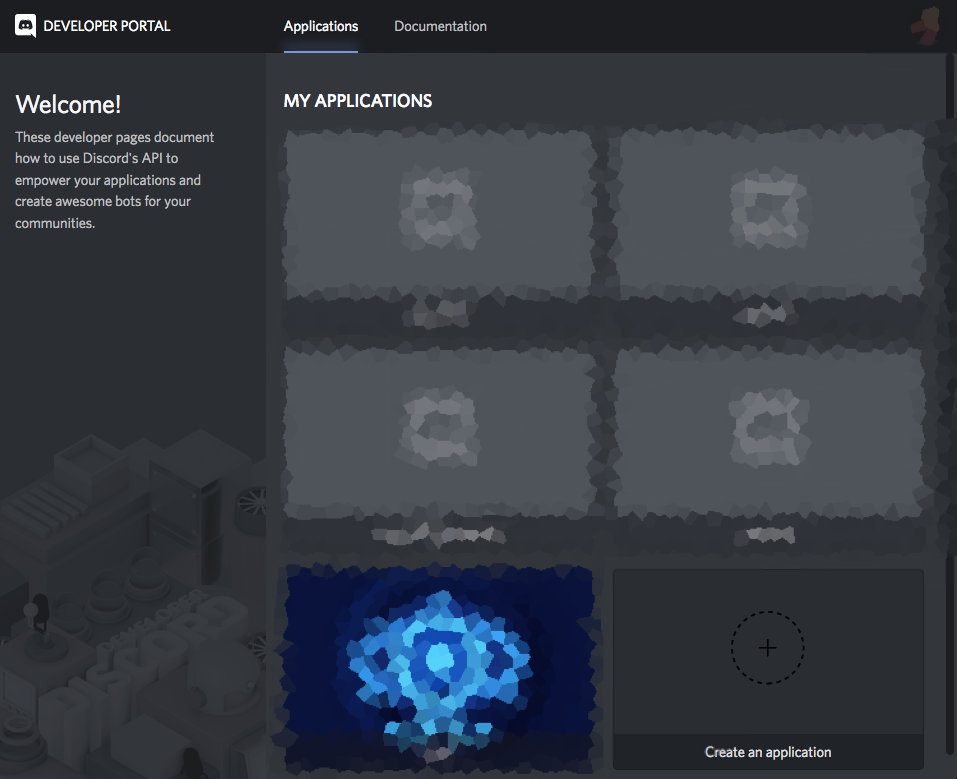
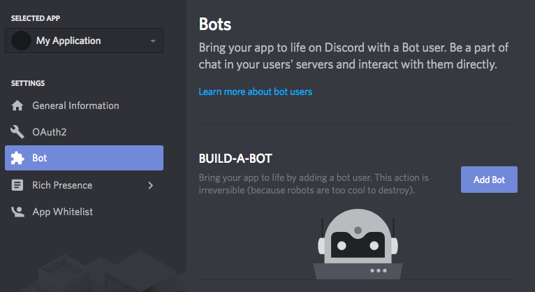
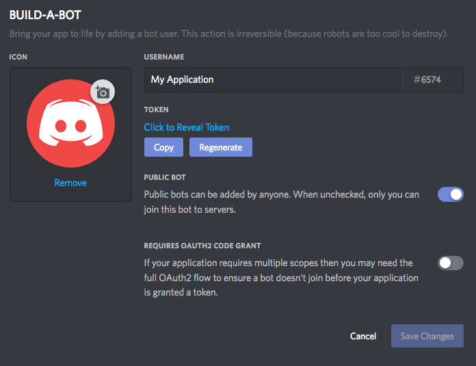

少し前，学内のイベントでRubyに触れて以来ちょっと気に入ってしまいました．パーレンの省略とかnilガードとかブロックとかProcとか... 省略は無闇に行うと可読性とかどうなの，とか思いますが，なんとなく書き心地良くて気に入りました．Botのコードでは手続き的な処理で済んでしまっているのでオブジェクト指向全く触れてませんが．  

そんな感じでRubyでなにか作ろうと思って，1年ほど前にPHPで作ろうとして挫折したDiscordのBotを作ってみましたので記録します．  
[gyneco2d/discord-navi](https://github.com/gyneco2d/discord-navi)

## ライブラリ(discordrb)のインストール
今回は，[discordrb](https://github.com/meew0/discordrb)というライブラリを使ってDiscord APIを利用します．非公式ライブラリは他にも色々以下のページにまとまってたりします．  
[Libraries | Unofficial Discord API](https://discordapi.com/unofficial/libs.html)  

Rubyのライブラリは`gem`という形式で公開されているらしいので  
`$ gem install discordrb`  
でインストールできる．MacOSならこれで通ると思いますけど，サーバなどで環境構築しようとすると，  
`ERROR: Failed to build gem native extension.`  
なんてエラーが出たりする．これは大抵`ruby-dev`や`gcc`などの各種コンパイラがインストールされてないためだったりするので適当にインストールしておきましょ．

> 今回初めてまともに動くBotを作ったので初めてVPS契約して稼働させたんですが，サーバ契約するのが初めてだったもので環境構築にそこそこ手間取りました．`gcc`すら入ってないんですね，そういえば．  
Ubuntu等の`apt-get`が使える環境であれば  
`$ sudo apt-get install build-essential`  
でC/C++標準開発ツール一式: C/C++コンパイラ、Make等の標準開発ツール一式がインストールできるみたいなので取り敢えず最初に実行しておくといいかも．

## Botの登録
Discordアカウントにログインした状態でBotの登録をします．ここはBot作成の記事で散々紹介されているので省こうと思ったんですが，ちょうどこれ書いてる最中に少しUI変わってたのでメモっときます．  

このページ（[https://discordapp.com/developers/applications/](https://discordapp.com/developers/applications/)）から`Create an application`をクリックして新しくBotを作成します．


作成したBotの詳細ページに遷移するので，NAMEやAPP ICONを設定したりしなかったりした後`CLIENT ID`を控えときます．


続いて，bot userなるものを追加します．左のサイドメニューからBotの項目に飛んで`Add Bot`クリック → `Yes, do it!`する．


`Click to Reveal Token`をクリックして出てくる`TOKEN`も控えときます．


最後に`CLIENT ID`を置き換えた下記のURLにアクセスすると，任意のギルドにBotを追加できる．

`https://discordapp.com/oauth2/authorize?client_id=🔢🔢🔢&scope=bot&permissions=0`


## Botの起動
discordrbのソースにはexampleがついてるので取り敢えずBotを起動してみる．  
[meew0/discordrb: Discord API for Ruby](https://github.com/meew0/discordrb)  
上記リポジトリから`examples/commands.rb`をひっぱってきて，`B0T.T0KEN.here`を控えておいた`TOKEN`で置き換えて実行する．

```bash
$ curl https://raw.githubusercontent.com/meew0/discordrb/master/examples/commands.rb > commands.rb
$ vim commands.rb # TOKENを置き換える
$ ruby commands.rb
Using WSCS version: 0.3.0
[INFO : websocket @ 2018-07-23 17:56:56.327] Discord using gateway protocol version: 6, requested: 6
```

### Bot起動 ('ω')!!!


`!help`と打てば使えるコマンドをリストしてくれる


> 記事が長くなりすぎるとサイト内検索を実装してるAlgoliaのAPIが使えなくなるようなので記事分割．  
> 次の記事（`DiscordのBotを作る #2`）へ続きます．
