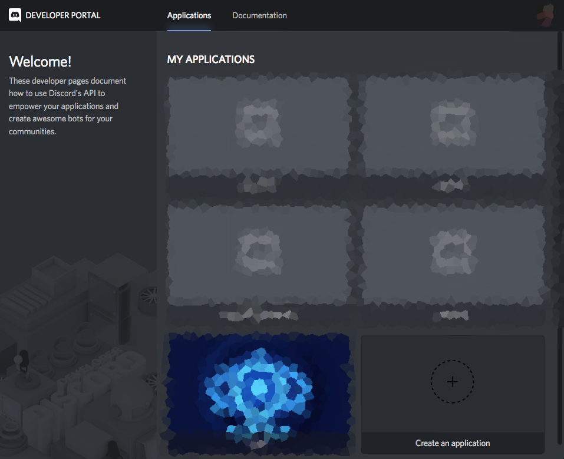
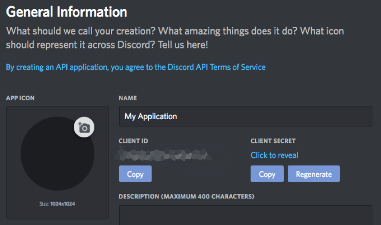
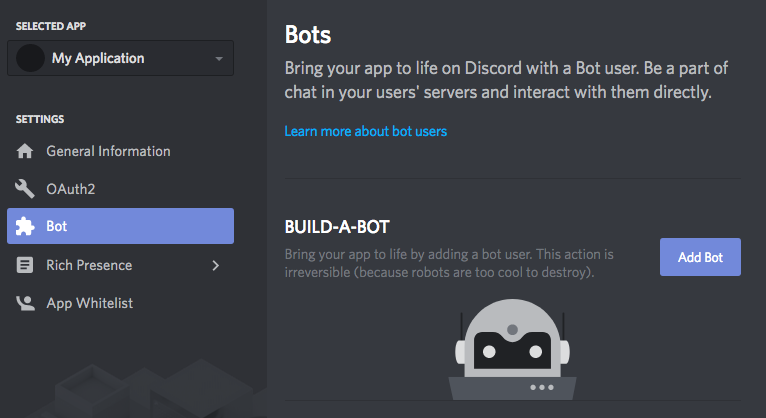
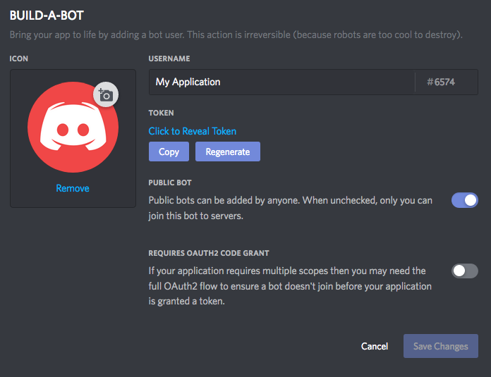
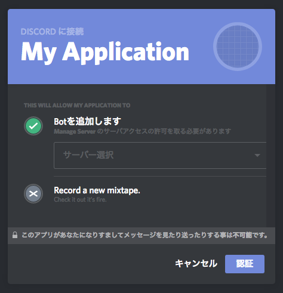
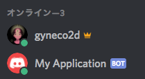
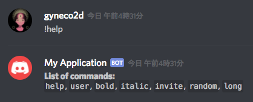
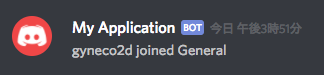

少し前，学内のイベントでRubyに触れて以来ちょっと気に入ってしまいました．パーレンの省略とかnilガードとかブロックとかProcとか... 省略は無闇に行うと可読性とかどうなの，とか思いますが，なんとなく書き心地良くて気に入りました．Botのコードでは手続き的な処理で済んでしまっているのでオブジェクト指向全く触れてませんが．  

そんな感じでRubyでなにか作ろうと思って，1年ほど前にPHPで作ろうとして挫折したDiscordのBotを作ってみましたので記録します．  
[gyneco2d/discord-navi](https://github.com/gyneco2d/discord-navi)

## ライブラリ(discordrb)のインストール
今回は，[discordrb](https://github.com/meew0/discordrb)というライブラリを使ってDiscord APIを利用します．非公式ライブラリは他にも色々以下のページにまとまってたりする．  
[Libraries | Unofficial Discord API](https://discordapi.com/unofficial/libs.html)  

Rubyのライブラリは`gem`という形式で公開されているらしいので  
`$ gem install discordrb`  
でインストールできる．MacOSならこれで通ると思いますけど，サーバなどで環境構築しようとすると，  
`ERROR: Failed to build gem native extension.`  
なんてエラーが出たりする．これは大抵`ruby-dev`や`gcc`などの各種コンパイラがインストールされてないためだったりするので適当にインストールしておきましょ．

> 今回初めてまともに動くBotを作ったので初めてVPS契約して稼働させました．サーバ契約するのが初めてだったものでMac上で動いていたBotを動かすための環境構築にそこそこ手間取りました．  
Ubuntu等の`apt-get`が使える環境であれば  
`$ sudo apt-get install build-essential`  
でC/C++標準開発ツール一式: C/C++コンパイラ、Make等の標準開発ツール一式がインストールできるみたいなので最初に実行しておくといいかも．

## Botの登録
Discordアカウントにログインした状態でBotの登録をします．ここはBot作成の記事で散々紹介されているので省こうと思ったんですがUI変わってたのでメモっときます．  

このページ（[https://discordapp.com/developers/applications/](https://discordapp.com/developers/applications/)）から`Create an application`をクリックして新しくBotを作成します．


作成したBotの詳細ページに遷移するので，NAMEやAPP ICONを設定したりしなかったりした後`CLIENT ID`を控えときます．


続いて，bot userなるものを追加します．左のサイドメニューからBotの項目に飛んで`Add Bot`クリック → `Yes, do it!`する．


`Click to Reveal Token`をクリックして出てくる`TOKEN`も控えときます．


最後に`CLIENT ID`を置き換えた下記のURLにアクセスすると，任意のギルドにBotを追加できる．

`https://discordapp.com/oauth2/authorize?client_id=🔢🔢🔢&scope=bot&permissions=0`


## Botの起動
discordrbのソースにはexampleがついてるので取り敢えずBotを起動してみる．  
[meew0/discordrb: Discord API for Ruby](https://github.com/meew0/discordrb)  
上記リポジトリから`examples/commands.rb`をひっぱってきて，`B0T.T0KEN.here`を控えておいた`TOKEN`で置き換えて実行する．

```bash
$ curl https://raw.githubusercontent.com/meew0/discordrb/master/examples/commands.rb > commands.rb
$ vim commands.rb # TOKENを置き換える
$ ruby commands.rb
Using WSCS version: 0.3.0
[INFO : websocket @ 2018-07-23 17:56:56.327] Discord using gateway protocol version: 6, requested: 6
```

### Bot起動 ('ω')!!!


`!help`と打てば使えるコマンドをリストしてくれる


## コード書く
めでたく起動したのであとはWikiとかドキュメント参照してコード書きましょう．
- [Home · meew0/discordrb Wiki](https://github.com/meew0/discordrb/wiki)
- [Module: Discordrb — Documentation for meew0/discordrb (master)](https://www.rubydoc.info/github/meew0/discordrb/Discordrb)

イベントハンドラを追加するにはフィルタ属性のリストとブロックと共にそれぞれのメソッドを呼び出せばいいので，（Wikiより）

```ruby
require 'discordrb'

bot = Discordrb::Commands::CommandBot.new token: 'B0T.T0KEN.here', client_id: 'BOT.CLIENT_ID.here', prefix: '!'

bot.message(with_text: "Hey Bot!") do |event|
    event.respond "Hi, #{event.user.name}!"
end

bot.run
```

こんな感じで記述すると，"Hey Bot!"というテキストに対して"Hi, {ユーザ名}"と返すようになります．（exampleでは与えてませんでしたが，botインスタンス生成時に`CLIENT_ID`も与えときましょう．）

> 最初はいまいち何してるかわかりませんでした．ライブラリ読んでみると，`message`メソッドは`Discordrb::Commands::CommandBot`のスーパークラス`Discordrb::Bot`がincludeしている`Discordrb::EventContainer`モジュールで定義されていて，フィルタ属性とブロックを渡してイベントを登録してるのがわかります．Rubyはメソッド呼び出しの時に引数と一緒にブロック渡せるんですね．  
> ```ruby
> # discordrb/container.rb
> def message(attributes = {}, &block)
>   register_event(MessageEvent, attributes, block)
> end
> ```

コマンドの定義ならこんな感じ
```ruby
bot.command :hello do |event|
  event.respond "Hello, #{event.user.name}"
end
```

## ボイスチャンネルへの参加をテキストチャンネルへ通知する
Discordは同じボイスチャンネルに参加していない限り誰かが新しく参加してきても何の通知もありません．ので新しくユーザがボイスチャンネルに参加した時，テキストチャンネルで通知するようにします．暇なときしれっとボイスチャンネルに接続しとけば誰かかまってくれるかもしれません．|ω' ) ﾇｯ  

ボイスチャンネルへの参加は`voice_state_update`で取れるので，  
```ruby
bot.voice_state_update do |event|

end
```
このブロックを記述する．誰かがボイスチャンネルに接続した時発火するイベントはこれ  
[Class: Discordrb::Events::VoiceStateUpdateEvent — Documentation for meew0/discordrb (master)](https://www.rubydoc.info/github/meew0/discordrb/Discordrb/Events/VoiceStateUpdateEvent)

参加時のみ通知したいので`old_channel`が`nil`のときのみ`send_message`します．  
```ruby
if event.old_channel.nil?
  # text notification
  text = "#{event.user.name} joined #{event.channel.name}"
  event.bot.send_message(default_text_channel, text)
end
```

メッセージを送るテキストチャンネルIDが必要なので事前に取得しとかなきゃならないですね．デフォルトで存在する"general"があればそこに，なければ最初に取得できたチャンネルに．Discordはチャンネル一つもない状況が作れるみたいなのでテキストチャンネルがなければ警告くらいだしとけばいいかな．（自分の作ったもので初めて例外処理書いた気がします...）  
```ruby
begin
  default_text_channel = nil
  event.server.channels.each do |channel|
    if channel.type == 0
      default_text_channel ||= channel.id
      default_text_channel = channel.id if channel.name == 'general'
    end
  end
  exit unless default_text_channel
rescue SystemExit => err
  puts "[WARN] There is no text channel."
end
```

最後に，Botアカウントには反応したくないので`user.bot_account`が`false`のときのみ処理するとして，こんな感じになりました．
```ruby
voice_state_update do |event|
  if !event.user.bot_account
    # get default text channel
    begin
      default_text_channel = nil
      event.server.channels.each do |channel|
        if channel.type == 0
          default_text_channel ||= channel.id
          default_text_channel = channel.id if channel.name == 'general'
        end
      end
      exit unless default_text_channel
    rescue SystemExit => err
      puts "[WARN] There is no text channel."
    end

    # notify only when joining any channel
    if event.old_channel.nil?
      # text notification
      text = "#{event.user.name} joined #{event.channel.name}"
      event.bot.send_message(default_text_channel, text)
    end
  end
end
```

### チャンネルへの参加を通知． 誰か相手して('ω')!!!  



## モジュールを使う
大まかな機能毎にコード管理したかったのでmodule使ってコード分割します．
ディレクトリ構成は大体こんな感じ（GitHubでRubyのリポジトリ漁って~~パクり~~参考にしました．）

```bash
$ tree src
src
├── bot.rb
└── modules
    ├── commands
    │   └── general.rb
    ├── events
    │   ├── join_announcer.rb
    │   └── mention.rb
    └── helpers
        └── soundfile.rb

4 directories, 5 files
```

`general.rb`にコマンド類を記述したいので，`CommandContainer`をextendしたモジュール作ってコマンド定義しときます．`voice_state_update`の処理は`join_announcer.rb`として同様にモジュールとしてまとめる．  
```ruby
# general.rb
require 'discordrb'

module Bot::Commands
  module General
    extend Discordrb::Commands::CommandContainer
    command :hello do |event|
      event.respond "Hello, #{event.user.name}"
    end
  end
end
```

これを`bot.rb`内で`CommandBot`のインスタンスBOTにincludeする．`bot.rb`はモジュールの読み込みと`BOT.run`のみ．  
```ruby
def self.load_modules(cls, path)
  new_module = Module.new
  const_set(cls.to_sym, new_module)
  Dir["src/modules/#{path}/*rb"].each { |file| load file }
  new_module.constants.each do |mod|
    BOT.include! new_module.const_get(mod)
  end
end

load_modules(:Commands, 'commands')
load_modules(:Events, 'events')
```

なるほど(˘ω˘) ← いまいち理解してない  
> `#load_modules`は指定したシンボルと読み込んだモジュールを記述したファイルから新しくモジュール作って`BOT`にincludeしてるんでしょか．`#include!`が調べてもいまいちわからない．


## まとめ
取り敢えずボイスチャンネルへの参加をテキストチャンネルに通知するDiscord Botが作れました．  
なんだかんだMac上で動いたBotを契約したVPS上で動くようにするための環境構築に一番時間がかかった気がします．この環境構築の手順も自分のためにまとめときたいですね．  

あと，ボイスチャンネルに参加したユーザ名を音声通知する機能も実装したんですが，ボイスチャンネルに人がいなくなったとき謎の警告を吐くのが解決してない&記事が長くなりすぎるのでまた今度まとめます．（GitHub上のリポジトリは音声通知まで実装してます．）  

Bot作成，ちょっと書けばすぐ動くし簡単に機能追加できそうなのでおすすめです．たのしい．しかも，人の実装みて理解しようとすると学ぶことが多くて結構勉強になったのでよかったですね．  
あとはYoutubeからRSS拾って推しのVTuberの通知流してギルド内の人間に無理やり推しまくる機能とか実装したいですね...
